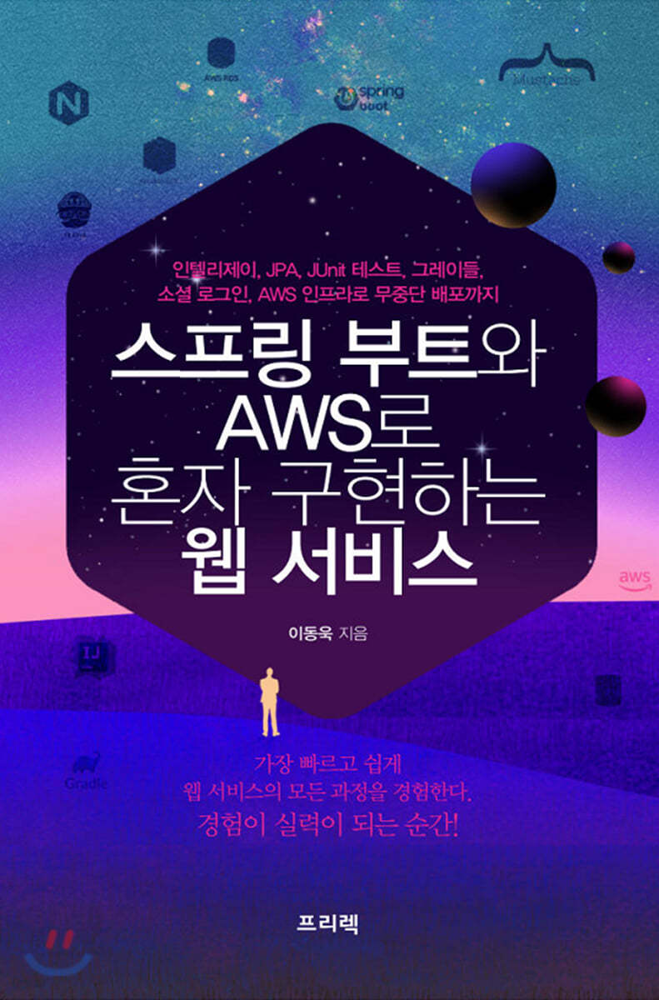

# web-service-using-spring-boot-and-AWS

> 『스프링 부트와 AWS로 혼자 구현하는 웹 서비스』를 읽고 공부하며 정리하는 저장소입니다.   This is a repository where you can read, study, and organize “A Web Service Implemented Alone with Spring Boot and AWS.”

## 목차

- [01장. 인텔리제이로 스프링 부트 시작하기](document/chapter01)
- [02장. 스프링 부트에서 테스트 코드 작성하자](document/chapter02)
- [03징. 스프링 부트에서 JPA로 데이터베이스 다뤄보자](document/chapter03)
- [04장. 머스테치로 화면 구성하기](document/chapter04)
- [05장. 스프링 시큐리티와 OAuth 2.0으로 로그인 기능 구현하기](document/chapter05)
- [06장. AWS 서버 환경 만들어보자 - AWS EC2](document/chapter06)
- [07장. AWS에 데이터베이스 환경을 만들어보자 - AWS RDS](document/chapter07)
- [08장. EC2 서버에 프로젝트를 배포해 보자](document/chapter08)
- [09장. 코드가 푸시되면 자동으로 배포해 보자](document/chapter09)
- [10장. 24시간 365일 중단 없는 서비스를 만들자](document/chapter10)
- [11장. 1인 개발 시 도움이 될 도구와 조언들](document/chapter11)